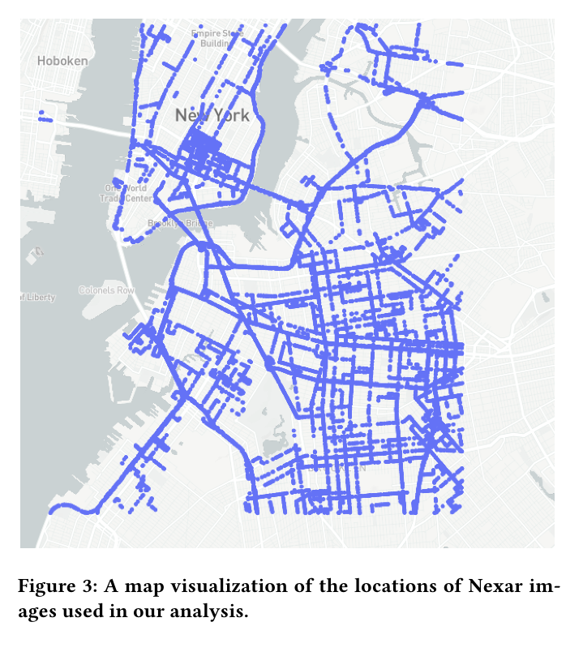

# Summer-2021-WINLAB

## Abstract 
COVID-19 has disrupted urban life in many different ways. To control the spread of the pandemic, social distancing has been mandated by state and city governments per the recommendations of public health officials. The compliance level among the public regarding such mandates is crucial to effectively slow down or stop the spread. The public activity of pedestrians in the street during the‘stay-at-home’ order is an approximation of ‘urban living’ under theconstraints of such mandates. However, the degree of complianceis hard to measure without explicit input from the pedestriansthemselves. As different areas of urban locations such as New York City experiences a varied level of the virus spread, several questions emerge.
- [x] **How have social distancing mandates influenced the activities and life in the city?**
- [x] **How did life in the city changeduring different phases of the pandemic?**

## Method
By combining computer vision and natural language processing techniques, we develop a language model to provide a semantic description of an image to understand the public activities presentin the scene. This is achieved based on a **vision-language model** trained on a publicly available dataset and then fine-tuned on our labeled dataset. We use our trained model to generate semantically coherent image descriptions and filter out the words thatare specific to public activities outlining the actor, action, and lo-cation (who, what, where). By modeling the word distributions through topic modeling techniques such as **Latent Dirichlet Dis-tribution (LDA)**, we identify salient themes in neighborhoodsover a specific period through topic modeling and compare topicdistributions to detect changes over time. 
 
## Dataset 
To build the street-level perspective of the city and urbanactivities, we use on-road data from dashboard cameras (“dash-cams”) of vehicles driving throughout NY city streets. To accesslarge-scale cameras capturing public activities, we established adata exchange relationship with Nexar, a company that collectsdata from connected dashcams deployed in Uber, Lyft, and city taxis to improve road safety.


We have licensed access to Nexar’sdatabase of NYC street-level images that enable us to form a morecomprehensive map of street occupancy and activity over time.This wide-scale dataset gives us a more subtle understanding of thestreet and its small-scale human interactions. These data give usa deeper understating of how people are adapting their socializa-tion and activities on the street to factors such as social distancing policies.



### Vision-language modeling

### LDA(Latent Dirichlet Distribution)
The generated caption sets are used asthe text input for our topic modeling step, where we model thetext in each caption to find hidden structures in the set of captions.This helps us to represent the words in the caption text into thetopic space and build several clusters of words. The caption of each image thus becomes a mixture of several topics whereas each topicbecomes a collection of several words.

### Why LDA?
While there are several exiting techniques for modeling topicsin a collection of text such as Latent Semantic Analysis (LSA) andProbabilistic Latent Semantic Analysis (pLSA), we choose LatentDirichlet Allocation (LDA) [7] over them as the other techniques produce non-interpretable embeddings in the high dimensionalspace and require a large corpus to yield a well-performing model.LDA is a generative probabilistic model that works under the as-sumption that each topic is a mixture of the underlying set of words,and each document is a mixture of a set of topic probabilities


## Results
Recall that we hypothesize that the changes in urban activity dueto external events such as public health emergencies (e.g., Covid-19outbreak) can be captured and sensed through the street images.The topic distributions observed in different time-frame and com-paring their similarity can provide insight to specific points or timesin the timeline when a change occurred. Using the timestamps, each image is assigned into different timebins to capture weekly, bi-weekly and monthly transition over the6 months. The similarity of each bin from all other bins is computedusing Hellinger distance and is presented as a similarity matrix inFigures 5, 6, and 7. Each cell represents the distance between thecorresponding time bins (denoted by the row and column). Thematrix is symmetric from the diagonal. We present the values as aheat map, where the higher values are denoted by green. The rangeof values for a Hellinger distance is between 0.0 to 1.0 (1.0 denotinghigher distance with green cells).


```diff
- From our analysis, the months of April, June, and July are vastly different from March to August 2020.
```

## Validation using External Data 

## Discussion and Future Work
- [x] Limited labels.
- The approach presented in this paper is basedon transfer learning where we used only 1000 labeled images forfine-tuning a pre-trained model. As our captioning model involves∼500,000 parameters, the performance of the finetuned model canbe further improved if more labeled image-text pairs can be utilized.Additionally, multiple captions for every image labeled by morethan one annotator can introduce more diversity and improvementto caption generation tasks and topic modeling as well.
- [x] Dataset imbalance.
- Our experiments and evaluation are basedon Nexar dashcam images which we assume as an approximation ofurban life and activities of New York City. However, the dataset isimbalanced across different neighborhoods in the city.The dataset contains more images from Manhattan and Brooklyn and thusis biased towards these areas in its observation. Our validationdata source also has its limitation as it does not cover all kindsof demographics, especially age as older people are less likely toparticipate in SafeGraph’s data collection protocol. Thus this datacan be insufficient to include all real-world features to approximatethe city. More detailed analysis and model correction is required tode-bias applications built based on this dataset.Every neighborhood consists of several different areas that canvary a lot in terms of the distribution of race, socio-economic status,and age. We randomly sample∼500 images from Manhattan 5 times,separated them into their respective area based on geo-location,and report the average in Figure 11. Image distributions in differentareas of Manhattan are highly imbalanced with Lower Manhattanand East Harlem being the least represented areas (note Figure 11).Note that Lower Manhattan is the business center of the city witha median household income of∼$200,000whereas East Harlemhas a median income of∼$21,000(10% of lower Manhattan) witha Hispanic-based population. Thus, an imbalanced image represen-tation of the city cannot capture people and their activities for allkinds of races, ages, and economic conditions which can trickleinto the model and bias the model’s view regarding the world. Moredata need to be collected for these areas to balance the dataset formodeling purposes.


